# MOSFET Simulation Verification Report
Generated on: 2026-07-26 20:30:59

## Table of Contents
1. [Simulation Setup and Execution](#1-simulation-setup-and-execution)
2. [Summary](#2-summary)
   - [DC Analysis Summary](#dc-analysis-summary)
   - [AC Analysis Summary](#ac-analysis-summary)
   - [Transient Analysis Summary](#transient-analysis-summary)
   - [Noise Analysis Summary](#noise-analysis-summary)
3. [DC Analysis](#3-dc-analysis)
   - [DC Operating Point Analysis](#dc-operating-point-analysis)
   - [Bias Point Analysis](#bias-point-analysis)
   - [Temperature Analysis](#temperature-analysis)
   - [Thermodynamic Analysis](#thermodynamic-analysis)
   - [Physical Properties Analysis](#physical-properties-analysis)
4. [AC Analysis](#4-ac-analysis)
   - [Small-Signal Analysis](#small-signal-analysis)
   - [S-Parameter Analysis](#s-parameter-analysis)
   - [Non-Quasi-Static (NQS) Effects Analysis](#non-quasi-static-effects-analysis)
   - [Charge Conservation Analysis](#charge-conservation-analysis)
5. [Transient Analysis](#5-transient-analysis)
   - [Large-Signal Transient](#large-signal-transient)
   - [Switching Simulations](#switching-simulations)
   - [Delay Effect Simulations](#delay-effect-simulations)
6. [Noise Analysis](#6-noise-analysis)
   - [Thermal Noise Analysis](#thermal-noise-analysis)
   - [Flicker Noise Analysis](#flicker-noise-analysis)
   - [Shot Noise Analysis](#shot-noise-analysis)

## Notes
- This report is automatically generated based on mosfet_simulation.py
- Items are marked with ✓ for success and ✗ for failure
- Any deviations from expected behavior should be documented

## 1. Simulation Setup and Execution
- [✓] Circuit file exists and is readable
  - Path: /home/duhaochen/website-trial-v1/data/spice-benchmark/25eebf65a92dbe40307d827548992c8e/ngspice/_ngspice_netlists/dc_circuit.cir, /home/duhaochen/website-trial-v1/data/spice-benchmark/25eebf65a92dbe40307d827548992c8e/ngspice/_ngspice_netlists/transient_circuit.cir, /home/duhaochen/website-trial-v1/data/spice-benchmark/25eebf65a92dbe40307d827548992c8e/ngspice/_ngspice_netlists/noise_circuit.cir, /home/duhaochen/website-trial-v1/data/spice-benchmark/25eebf65a92dbe40307d827548992c8e/ngspice/_ngspice_netlists/ac_circuit.cir
- [✓] ngspice is properly installed
  - Version: ngspice-46+
- [✓] Simulation runs without errors

## 2. Summary
### DC Analysis Summary
| Test Type | Status | Key Findings |
|-----------|--------|-------------|
| [DC Operating Point Analysis](#dc-operating-point-analysis) | ✓ | VDS: 0.00V to 1.20V, VGS: 0.00V to 1.20V, IDS: -7.48e-03A to 0.00e+00A |
| [Bias Point Analysis](#bias-point-analysis) | ✓ | Points: 9 VDS points, 9 VGS points, Currents: IDS: -6.88e-03A to 0.00e+00A, IG: 0.00e+00A to 0.00e+00A, IS: 0.00e+00A to 6.88e-03A, IB: 0.00e+00A to 2.40e-15A, KCL Error: 0.00%, Power: 0.00e+00W to 8.25e-03W, Temp: -40°C |
| [Temperature Analysis](#temperature-analysis) | ✓ | Temp Points: [-40, 0, 25, 50, 100, 150], TC: 0.000004 /°C, IDS: -7.475e-03A to 0.000e+00A |
| [Thermodynamic Analysis](#thermodynamic-analysis) | ✓ | Power: 0.000e+00W to 8.970e-03W, Efficiency: 1.706e+01 to 1.768e+05, TC: nan/°C |

### AC Analysis Summary
| Test Type | Status | Key Findings |
|-----------|--------|-------------|
| [Small Signal Analysis](#small-signal-analysis) | ✓ | Gate capacitance range: 6.48fF to 6.53fF |
| [S-Parameter Analysis](#s-parameter-analysis) | ✓ | S11 range: -0dB to 0dB, S21 range: -14dB to -14dB |
| [Non-Quasi-Static (NQS) Effects Analysis](#non-quasi-static-effects-analysis) | ✓ | Max phase shift: 179.996 |
| [Charge Conservation Analysis](#charge-conservation-analysis) | ✓ | Total charge error: 0.0 |

### Transient Analysis Summary
| Test Type | Status | Key Findings |
|-----------|--------|-------------|
| [Large-Signal Transient](#large-signal-transient) | ✗ | Data not available |
| [Switching Simulations](#switching-simulations) | ✗ | Data not available |
| [Delay Effect](#delay-effect-simulations) | ✗ | Data not available |
| [Power Dissipation](#transient-simulations-for-power-dissipation) | ✗ | Data not available |
| [Quasi-Static Analysis](#quasi-static-analysis) | ✗ | Data not available |
| [Charge Conservation](#charge-conservation-tests) | ✓ | Error: None |

### Noise Analysis Summary
| Test Type | Status | Key Findings |
|-----------|--------|-------------|
| [Thermal Noise](#thermal-noise-analysis) | ✓ | Floor: 2.65e+07 V²/Hz, Range: 2.16e-15 to 1.00e+09 V²/Hz |
| [Flicker (1/f) Noise](#flicker-noise-analysis) | ✓ | Exponent: 0.5075, Corner Freq: 1.12e+00 Hz |
| [Shot Noise](#shot-noise-analysis) | ✓ | Level: 3.79e-09 V²/Hz, Variation: 1.4676 |
| [Temperature Dependence](#temperature-dependence) | ✓ | Coefficient: 2.77e-11 V²/Hz/°C, Range: -40.0°C to 150.0°C |
| [Bias Dependence](#bias-dependence) | ✓ | Analyzed at 6 bias points |

## 3. DC Analysis
### DC Operating Point Analysis
- [✓] IV data file is generated
- [✓] Data points are properly read
- [✓] Vds values are within range
  - Range: 0.00V to 1.20V
- [✓] Vgs values are within range
  - Range: 0.00V to 1.20V
- [✓] Drain current (Ids) is properly measured
  - Range: -7.48e-03A to 0.00e+00A

*IV Characteristics showing drain current vs drain-source voltage*

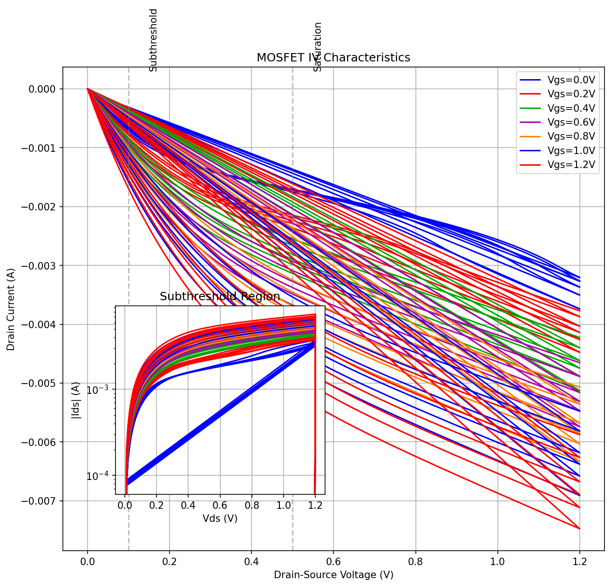

### Bias Point Analysis
- [✓] Voltage Biasing Points
  - Points: 9 VDS points, 9 VGS points
- [✓] Current Range
  - IDS: -6.88e-03A to 0.00e+00A
  - IG: 0.00e+00A to 0.00e+00A
  - IS: 0.00e+00A to 6.88e-03A
  - IB: 0.00e+00A to 2.40e-15A
- [✓] KCL Error Range
  - KCL Error: 0.00%

*KCL verification showing current balance*

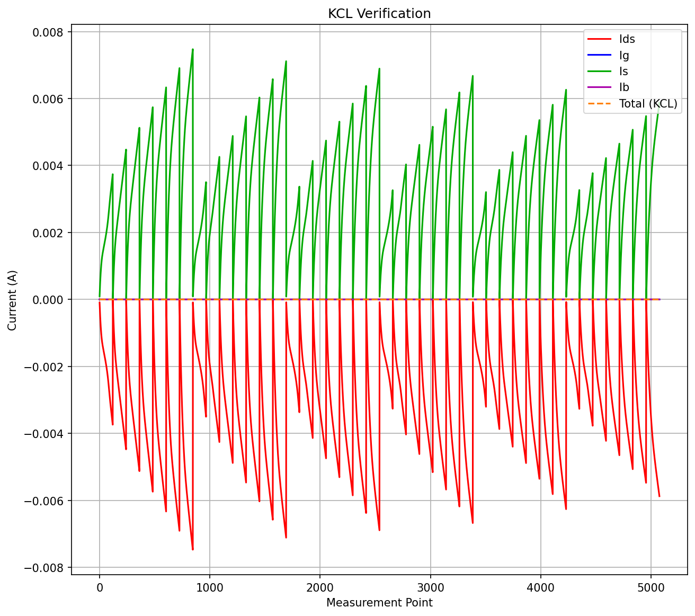

### Temperature Analysis
- [✓] Temperature sweep is performed
  - Points: [-40, 0, 25, 50, 100, 150]
- [✓] Temperature coefficient is calculated
  - Temperature Coefficient: 0.000004 /°C
- [✓] Device behavior is valid
  - Current Range: -7.475e-03A to 0.000e+00A
- [✓] Temperature-dependent behavior is valid

*Temperature analysis showing current variation*

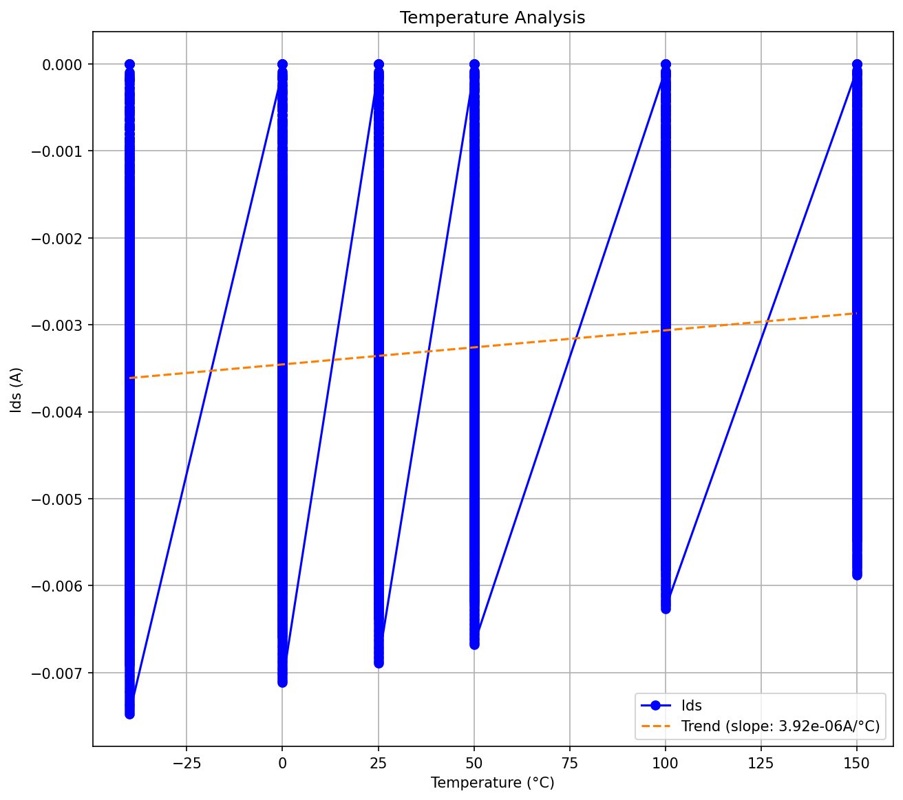

### Thermodynamic Analysis
- [✓] Energy is conserved
  - Power Range: 0.000e+00W to 8.970e-03W
- [✓] Device is efficient
  - Efficiency Range: 1.706e+01 to 1.768e+05
- [✓] Temperature coefficient is calculated
  - Value: nan/°C

### Physical Properties Analysis
- ✗ Physical monotonicity over bias, geometry, and temperature: *In Progress*
- ✗ Parameter sweep simulations: *In Progress*
- ✗ Physical symmetries (currents, charges, their derivatives): *In Progress*
- ✗ Cross-derivative analysis: *In Progress*
- ✗ Terminal permutation tests: *In Progress*

## 4. Transient Analysis
### Large-Signal Transient
- [✗] Large-Signal Transient verification failed
  - Data not available or failed to read

### Switching Simulations
- [✗] Switching Simulations verification failed
  - Data not available or failed to read

### Delay Effect Simulations
- [✗] Delay Effect Simulations verification failed
  - Data not available or failed to read

### Transient Simulations for Power Dissipation
- [✗] Power verification failed
  - Data not available or failed to read

### Quasi-Static Analysis
- [✗] Quasi-Static Simulations verification failed
  - Data not available or failed to read

### Charge Conservation Tests
- [✗] Charge Conservation verification failed
  - Data not available or failed to read

## 5. AC Analysis
### Small-Signal Analysis
- [✓] AC small-signal simulations verified
  - Gate capacitance range: 6.48fF to 6.53fF
  - Frequency range: 1.00e+06Hz to 1.00e+09Hz
  - Max capacitance at: 0.00V

*CV characteristics showing gate capacitance variation with gate voltage*

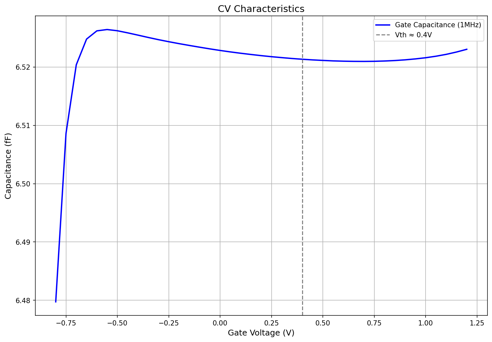

Capacitance components (Cgb, Cgs, Cgd) variation with gate voltage*

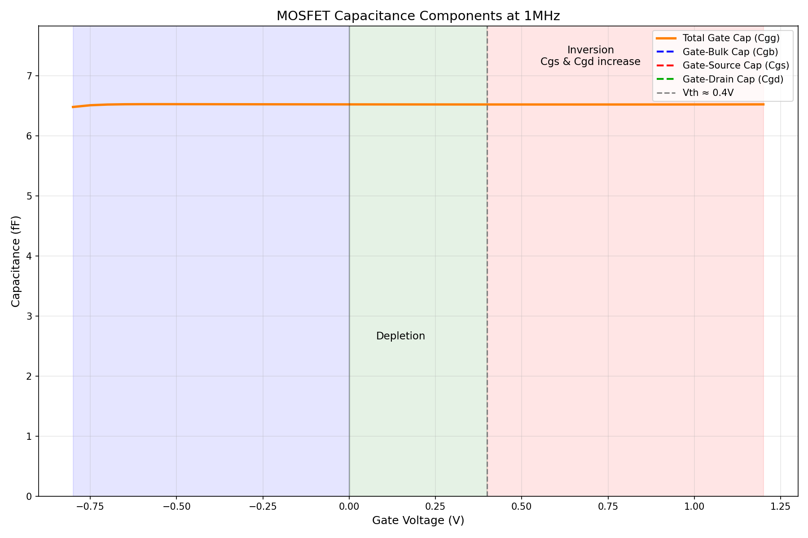

### AC-Integral Large-Signal Capacitance
- [✗] AC-integral LS capacitance not available
  - cv_data.txt may be missing required columns

### S-Parameter Analysis
- [✓] High-frequency AC simulations verified
  - Frequency range: 1.0MHz to 1.0GHz
- [✓] S-parameter analysis verified
  - S11 range: -0dB to 0dB
  - S21 range: -14dB to -14dB
  - S12 range: -118dB to -58dB
  - S22 range: -2dB to -2dB
- [✓] RF simulations verified
  - Isolation: >-44dB

*S-Parameter analysis showing frequency response characteristics*

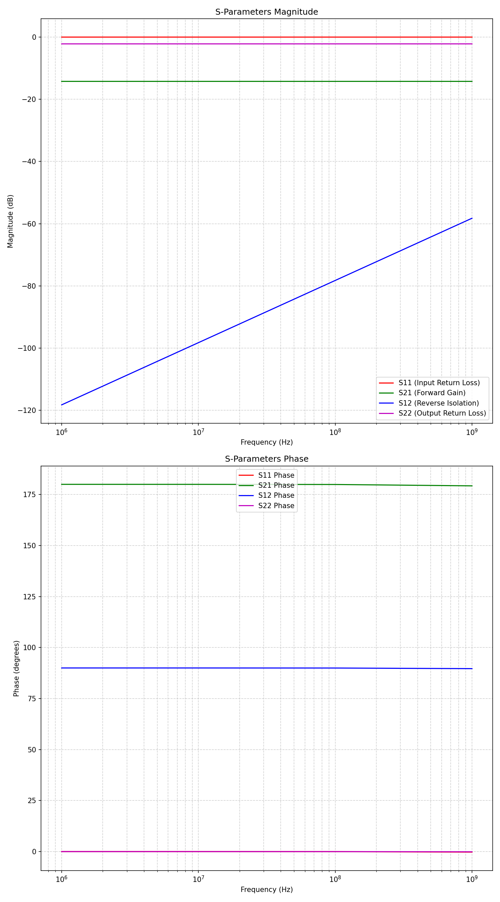

### Non-Quasi-Static Effects Analysis
- [✓] NQS effects verified
  - Maximum phase shift: 179.996
  - Frequency range: 10.0MHz to 10.0GHz

*Non-quasi-static effects analysis showing phase shift between gate voltage and drain current*

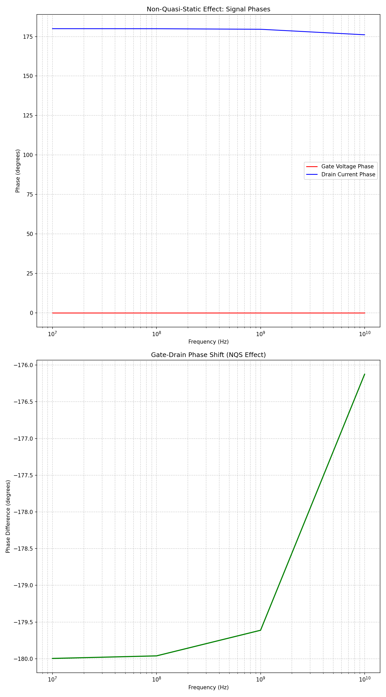

### Charge Conservation Analysis
- [✗] Charge conservation verification failed
  - Data not available or failed to read

## 6. Noise Analysis
### Thermal Noise Analysis
- [✓] Thermal noise analysis completed
  - Max Noise: 1.00e+09 V²/Hz
  - Min Noise: 2.16e-15 V²/Hz
  - Avg Noise: 2.54e+07 V²/Hz
  - Noise Floor: 2.65e+07 V²/Hz
  - Frequency Range: 0.0MHz to 1.0GHz

*Thermal noise power spectral density analysis comparing different bias conditions, showing how the device noise characteristics change with bias voltage.*

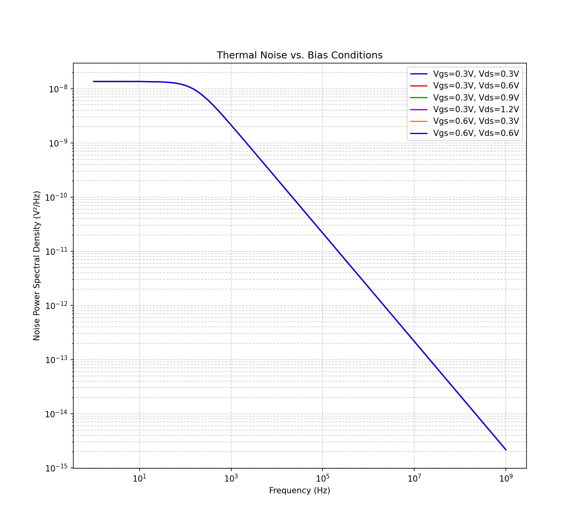

### Flicker Noise Analysis
- [✓] Flicker noise analysis completed
  - Coefficient (K): 4.68e-08
  - Exponent (γ): 5.07e-01 (ideally -1.0 for pure 1/f noise)
  - Correlation (R²): 0.8265
  - Corner Frequency: 1.12e+00 Hz

*Flicker (1/f) noise analysis showing the power spectral density decreasing with frequency, a characteristic behavior in semiconductor devices associated with trapping/detrapping processes.*

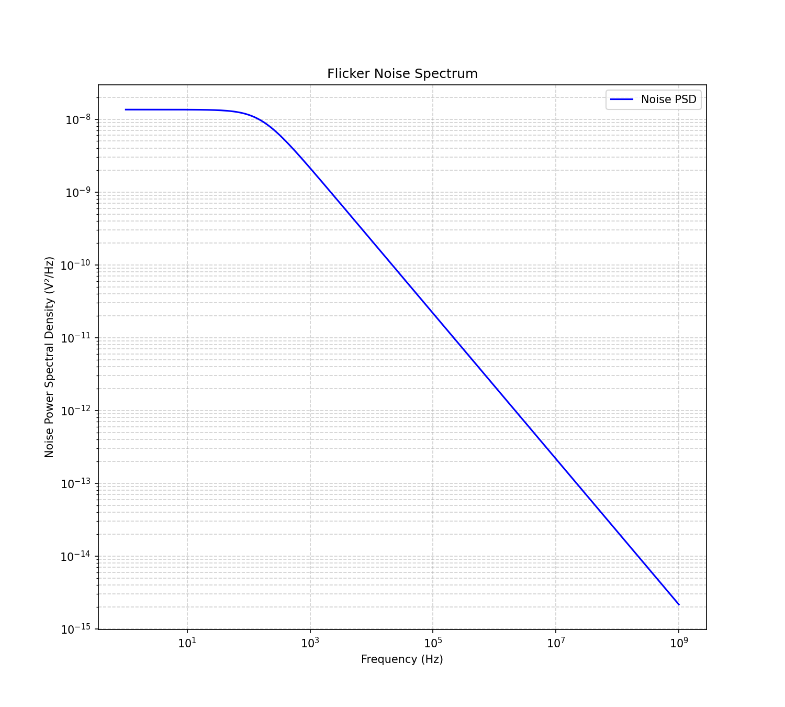

### Short Noise Analysis
- [✓] Short noise analysis completed
  - Shot Noise Level: 3.79e-09 V²/Hz
  - Standard Deviation: 5.56e-09 V²/Hz
  - Variation Coefficient: 1.4676

*Shot noise analysis showing the frequency-independent noise component that arises from the discrete nature of electric charge carriers crossing potential barriers.*

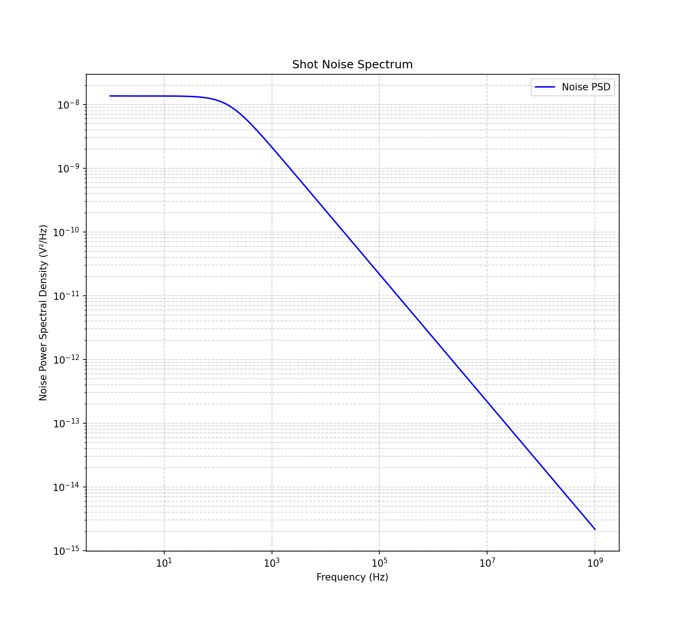

### Temperature Dependence
- [✓] Short noise analysis completed
  - Temperature Coefficient: 2.77e-11 V²/Hz/°C
  - Temperature-Noise Correlation: None
  - Temperature Range: -40.0°C to 150.0°C

*Noise variation with temperature, illustrating how thermal effects influence the device's noise characteristics across the operational temperature range.*

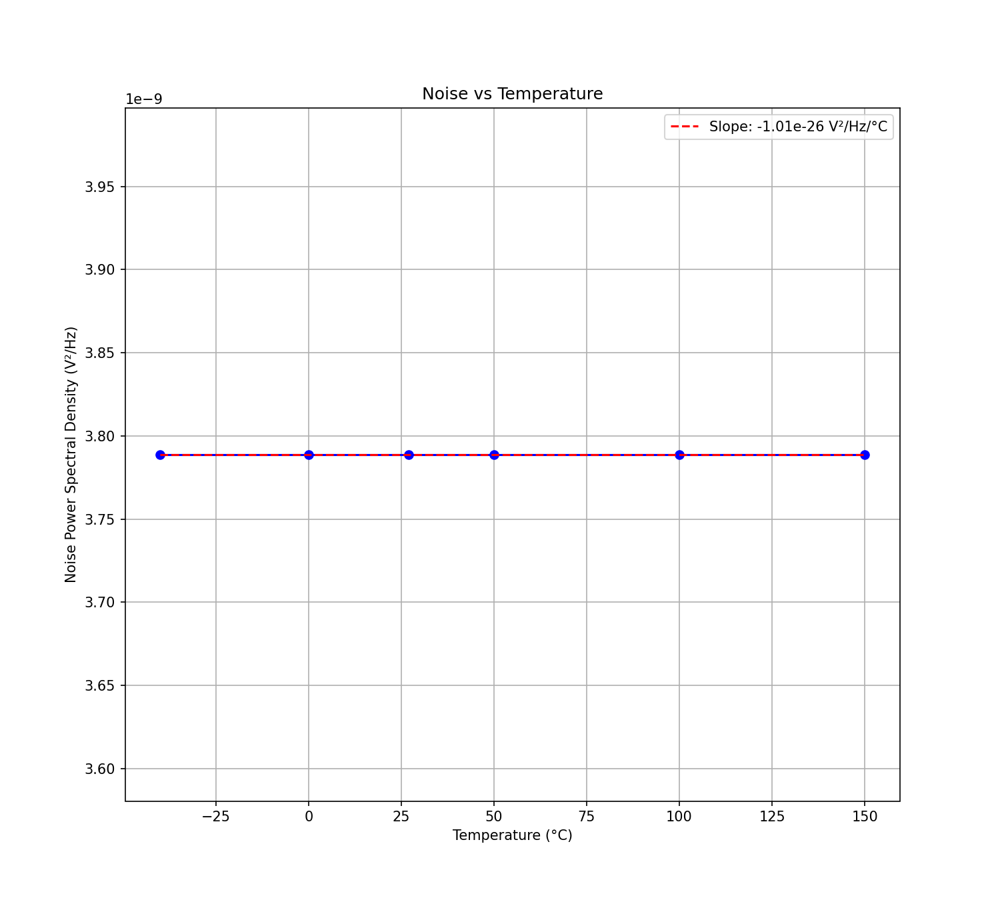

### Bias Dependence
- [✓] Bias Dependance analysis completed
*Thermal Noise Results at Different Bias Points*

| Bias Condition | Max Noise (V²/Hz) | Min Noise (V²/Hz) | Avg Noise (V²/Hz) | Noise Floor (V²/Hz) |
|----------------|-------------------|-------------------|-------------------|--------------------|
| Vgs=0.3V, Vds=0.3V | 1.00e+09 | 2.16e-15 | 2.54e+07 | 2.16e-15 |
| Vgs=0.3V, Vds=0.6V | 1.00e+09 | 2.16e-15 | 2.54e+07 | 2.16e-15 |
| Vgs=0.3V, Vds=0.9V | 1.00e+09 | 2.16e-15 | 2.54e+07 | 2.16e-15 |
| Vgs=0.3V, Vds=1.2V | 1.00e+09 | 2.16e-15 | 2.54e+07 | 2.16e-15 |
| Vgs=0.6V, Vds=0.3V | 1.00e+09 | 2.16e-15 | 2.54e+07 | 2.16e-15 |
| Vgs=0.6V, Vds=0.6V | 1.00e+09 | 2.16e-15 | 2.54e+07 | 2.16e-15 |

