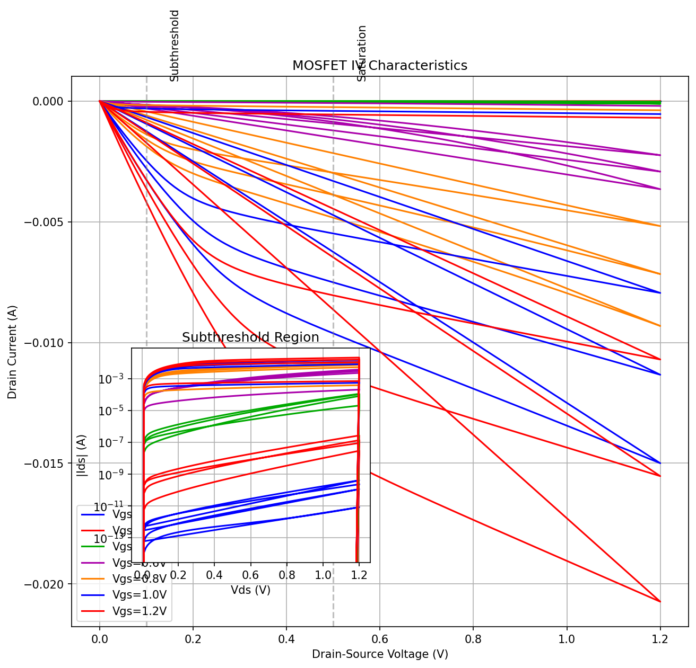
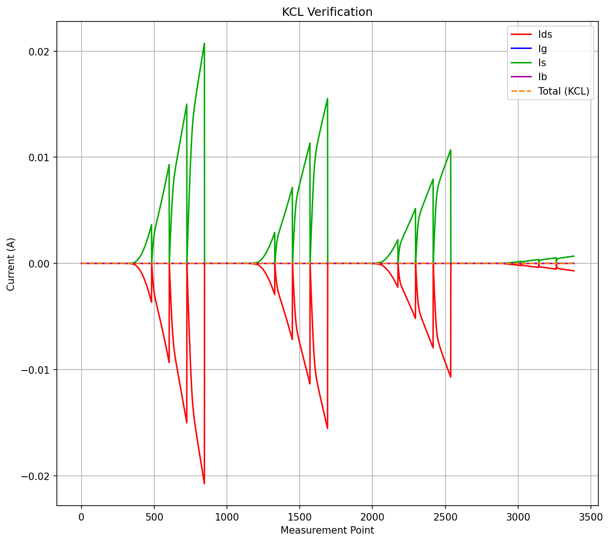
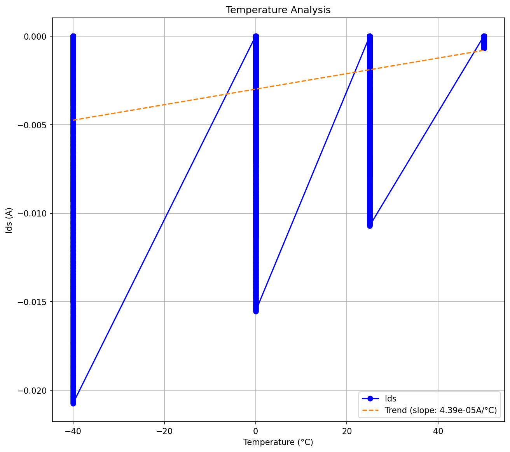

# MOSFET Simulation Verification Report
Generated on: 2026-07-26 20:38:10

## Table of Contents
1. [Simulation Setup and Execution](#1-simulation-setup-and-execution)
2. [Summary](#2-summary)
   - [DC Analysis Summary](#dc-analysis-summary)
   - [AC Analysis Summary](#ac-analysis-summary)
   - [Transient Analysis Summary](#transient-analysis-summary)
   - [Noise Analysis Summary](#noise-analysis-summary)
3. [DC Analysis](#3-dc-analysis)
   - [DC Operating Point Analysis](#dc-operating-point-analysis)
   - [Bias Point Analysis](#bias-point-analysis)
   - [Temperature Analysis](#temperature-analysis)
   - [Thermodynamic Analysis](#thermodynamic-analysis)
   - [Physical Properties Analysis](#physical-properties-analysis)
4. [AC Analysis](#4-ac-analysis)
   - [Small-Signal Analysis](#small-signal-analysis)
   - [S-Parameter Analysis](#s-parameter-analysis)
   - [Non-Quasi-Static (NQS) Effects Analysis](#non-quasi-static-effects-analysis)
   - [Charge Conservation Analysis](#charge-conservation-analysis)
5. [Transient Analysis](#5-transient-analysis)
   - [Large-Signal Transient](#large-signal-transient)
   - [Switching Simulations](#switching-simulations)
   - [Delay Effect Simulations](#delay-effect-simulations)
6. [Noise Analysis](#6-noise-analysis)
   - [Thermal Noise Analysis](#thermal-noise-analysis)
   - [Flicker Noise Analysis](#flicker-noise-analysis)
   - [Shot Noise Analysis](#shot-noise-analysis)

## Notes
- This report is automatically generated based on mosfet_simulation.py
- Items are marked with ✓ for success and ✗ for failure
- Any deviations from expected behavior should be documented

## 1. Simulation Setup and Execution
- [✓] Circuit file exists and is readable
  - Path: /home/duhaochen/website-trial-v1/data/spice-benchmark/794dc1a7574bd3ffd50e44ffc9b5c90b/model.lib
- [✓] ngspice is properly installed
  - Version: HSPICE S-2021.09
- [✓] Simulation runs without errors

## 2. Summary
### DC Analysis Summary
| Test Type | Status | Key Findings |
|-----------|--------|-------------|
| [DC Operating Point Analysis](#dc-operating-point-analysis) | ✓ | VDS: 0.00V to 1.20V, VGS: 0.00V to 1.20V, IDS: -2.07e-02A to 0.00e+00A |
| [Bias Point Analysis](#bias-point-analysis) | ✓ | Points: 2 VDS points, 2 VGS points, Currents: IDS: 0.00e+00A to 1.00e-03A, IG: 0.00e+00A to 1.00e-09A, IS: 0.00e+00A to 1.00e-03A, IB: 0.00e+00A to 1.00e-09A, KCL Error: 200.00%, Power: 0.00e+00W to 1.20e-03W, Temp: -40.0°C |
| [Temperature Analysis](#temperature-analysis) | ✗ | Temp Points: None, TC: 0.000044 /°C, IDS: -2.074e-02A to 0.000e+00A |
| [Thermodynamic Analysis](#thermodynamic-analysis) | ✓ | Power: 0.000e+00W to 2.488e-02W, Efficiency: 7.846e+00 to 2.808e+03, TC: nan/°C |

### AC Analysis Summary
| Test Type | Status | Key Findings |
|-----------|--------|-------------|
| [Small Signal Analysis](#small-signal-analysis) | ✗ | Data not available |
| [S-Parameter Analysis](#s-parameter-analysis) | ✗ | Data not available |
| [Non-Quasi-Static (NQS) Effects Analysis](#non-quasi-static-effects-analysis) | ✗ | Data not available |
| [Charge Conservation Analysis](#charge-conservation-analysis) | ✗ | Data not available |

### Transient Analysis Summary
| Test Type | Status | Key Findings |
|-----------|--------|-------------|
- [✗] Transient simulations failed
  - Data not available or failed to read
### Noise Analysis Summary
| Test Type | Status | Key Findings |
|-----------|--------|-------------|
| [Thermal Noise](#thermal-noise-analysis) | ✗ | Data not available |
| [Flicker (1/f) Noise](#flicker-noise-analysis) | ✗ | Data not available |
| [Shot Noise](#shot-noise-analysis) | ✗ | Data not available |
| [Temperature Dependence](#temperature-dependence) | ✗ | Data not available |
| [Bias Dependence](#detailed-noise-characteristics) | ✗ | Data not available |

## 3. DC Analysis
### DC Operating Point Analysis
- [✓] IV data file is generated
- [✓] Data points are properly read
- [✓] Vds values are within range
  - Range: 0.00V to 1.20V
- [✓] Vgs values are within range
  - Range: 0.00V to 1.20V
- [✓] Drain current (Ids) is properly measured
  - Range: -2.07e-02A to 0.00e+00A

*IV Characteristics showing drain current vs drain-source voltage*

### Bias Point Analysis
- [✓] Voltage Biasing Points
  - Points: 2 VDS points, 2 VGS points
- [✓] Current Range
  - IDS: 0.00e+00A to 1.00e-03A
  - IG: 0.00e+00A to 1.00e-09A
  - IS: 0.00e+00A to 1.00e-03A
  - IB: 0.00e+00A to 1.00e-09A
- [✓] KCL Error Range
  - KCL Error: 200.00%

*KCL verification showing current balance*

### Temperature Analysis
- [✓] Temperature sweep is performed
  - Points: None
- [✓] Temperature coefficient is calculated
  - Temperature Coefficient: 0.000044 /°C
- [✓] Device behavior is valid
  - Current Range: -2.074e-02A to 0.000e+00A
- [✓] Temperature-dependent behavior is valid

*Temperature analysis showing current variation*

### Thermodynamic Analysis
- [✓] Energy is conserved
  - Power Range: 0.000e+00W to 2.488e-02W
- [✓] Device is efficient
  - Efficiency Range: 7.846e+00 to 2.808e+03
- [✓] Temperature coefficient is calculated
  - Value: nan/°C

### Physical Properties Analysis
- ✗ Physical monotonicity over bias, geometry, and temperature: *In Progress*
- ✗ Parameter sweep simulations: *In Progress*
- ✗ Physical symmetries (currents, charges, their derivatives): *In Progress*
- ✗ Cross-derivative analysis: *In Progress*
- ✗ Terminal permutation tests: *In Progress*

## 4. Transient Analysis
- [✗] Transient simulations failed
  - Data not available or failed to read
## 5. AC Analysis
- [✗] AC simulations failed
  - Data not available or failed to read
## 6. Noise Analysis
### Thermal Noise Analysis
- [✗] Thermal Noise Analysis verification failed
  - Data not available or failed to read

### Flicker Noise Analysis
- [✗] Flicker Noise Analysis verification failed
  - Data not available or failed to read

### Short Noise Analysis
- [✗] Short Noise Analysis verification failed
  - Data not available or failed to read

### Temperature Dependence
- [✗] Temperature Dependence verification failed
  - Data not available or failed to read

### Bias Dependence
- [✗] Bias Dependence verification failed
  - Data not available or failed to read

