# MOSFET Simulation Verification Report
Generated on: 2026-07-29 20:02:19

## Table of Contents
1. [Simulation Setup and Execution](#1-simulation-setup-and-execution)
2. [Summary](#2-summary)
   - [DC Analysis Summary](#dc-analysis-summary)
   - [AC Analysis Summary](#ac-analysis-summary)
   - [Transient Analysis Summary](#transient-analysis-summary)
   - [Noise Analysis Summary](#noise-analysis-summary)
3. [DC Analysis](#3-dc-analysis)
   - [DC Operating Point Analysis](#dc-operating-point-analysis)
   - [Bias Point Analysis](#bias-point-analysis)
   - [Temperature Analysis](#temperature-analysis)
   - [Thermodynamic Analysis](#thermodynamic-analysis)
   - [Physical Properties Analysis](#physical-properties-analysis)
4. [AC Analysis](#4-ac-analysis)
   - [Small-Signal Analysis](#small-signal-analysis)
   - [S-Parameter Analysis](#s-parameter-analysis)
   - [Non-Quasi-Static (NQS) Effects Analysis](#non-quasi-static-effects-analysis)
   - [Charge Conservation Analysis](#charge-conservation-analysis)
5. [Transient Analysis](#5-transient-analysis)
   - [Large-Signal Transient](#large-signal-transient)
   - [Switching Simulations](#switching-simulations)
   - [Delay Effect Simulations](#delay-effect-simulations)
6. [Noise Analysis](#6-noise-analysis)
   - [Thermal Noise Analysis](#thermal-noise-analysis)
   - [Flicker Noise Analysis](#flicker-noise-analysis)
   - [Shot Noise Analysis](#shot-noise-analysis)

## Notes
- This report is automatically generated based on mosfet_simulation.py
- Items are marked with ✓ for success and ✗ for failure
- Any deviations from expected behavior should be documented

## 1. Simulation Setup and Execution
- [✓] Circuit files exist and are readable
  - DC: /home/duhaochen/website-trial-v1/data/spice-model-benchmark/35c51eb2c9233d013d733a2942a7daa4/ngspice/netlist/dc.cir
  - TRANSIENT: /home/duhaochen/website-trial-v1/data/spice-model-benchmark/35c51eb2c9233d013d733a2942a7daa4/ngspice/netlist/transient.cir
  - AC: /home/duhaochen/website-trial-v1/data/spice-model-benchmark/35c51eb2c9233d013d733a2942a7daa4/ngspice/netlist/ac.cir
  - NOISE: /home/duhaochen/website-trial-v1/data/spice-model-benchmark/35c51eb2c9233d013d733a2942a7daa4/ngspice/netlist/noise.cir
- [✓] ngspice is properly installed
  - Version: ngspice-46+
- [✓] Simulation runs without errors

## 2. Summary
### DC Analysis Summary
| Check Type | Status | Key Findings |
|-----------|--------|-------------|
| [DC Operating Point Analysis](#dc-operating-point-analysis) | ✓ | VDS: 0.00V to 1.20V, VGS: 0.00V to 1.20V, IDS: -5.23e-05A to 3.34e-22A |
| [Bias Point Analysis](#bias-point-analysis) | ✓ | Points: 9 VDS points, 9 VGS points, Currents: IDS: -2.73e-05A to 2.37e-27A, IG: 0.00e+00A to 0.00e+00A, IS: -2.37e-27A to 2.73e-05A, IB: -6.22e-36A to 1.12e-14A, KCL Error: 0.00%, Power: 0.00e+00W to 3.27e-05W, Temp: -40°C |
| [Temperature Analysis](#temperature-analysis) | ✓ | Temp Points: [-40, 0, 25, 50, 100, 150], TC: -0.000000 /°C, IDS: -5.226e-05A to 3.339e-22A |
| [Thermodynamic Analysis](#thermodynamic-analysis) | ✓ | Power: 0.000e+00W to 6.271e-05W, Efficiency: 9.187e+00 to 1.671e+10, TC: 2.72e-02/°C |

### AC Analysis Summary
| Check Type | Status | Key Findings |
|-----------|--------|-------------|
| [Small Signal Analysis](#small-signal-analysis) | ✓ | Gate capacitance range: 16.23fF to 22.67fF |
| [S-Parameter Analysis](#s-parameter-analysis) | ✓ | S11 range: -0.000729645dB to 0dB, S21 range: -58.294dB to -46.453dB |
| [Non-Quasi-Static (NQS) Effects Analysis](#non-quasi-static-effects-analysis) | ✓ | Max phase shift: 177.836 |
| [Charge Conservation Analysis](#charge-conservation-analysis) | ✓ | Total charge error: 0.0 |

### Transient Analysis Summary
| Check Type | Status | Key Findings |
|-----------|--------|-------------|
| [Large-Signal Transient](#large-signal-transient) | ✓ | Max Current: 1.629e-05A, Rise Time: 400ps |
| [Switching Simulations](#switching-simulations) | ✓ | Propagation Delay: 416.383ps (sample interval 2.7039ps), Power: 7.728e-05W (max), 6.452e-06W (avg) |
| [Delay Effect](#delay-effect-simulations) | ✓ | Total Chain Delay: 2648.26ps (sample interval 2.7039ps) |
| [Power Dissipation](#transient-simulations-for-power-dissipation) | ✓ | Temp Coeff: 1.691438e-08W/°C |
| [Quasi-Static Analysis](#quasi-static-analysis) | ✓ | I-V characteristics analyzed: None |
| [Charge Conservation](#charge-conservation-checks) | ✓ | Error: None |

### Noise Analysis Summary
| Check Type | Status | Key Findings |
|-----------|--------|-------------|
| [Thermal Noise](#thermal-noise-analysis) | ✓ | Floor: 6.22e-11 V²/Hz, Range: 1.82e-11 V²/Hz to 1.38e-10 V²/Hz |
| [Flicker (1/f) Noise](#flicker-noise-analysis) | ✓ | Exponent: 0.0000, Corner Freq: not resolved |
| [Shot Noise](#shot-noise-analysis) | ✓ | Level: 7.43e-10 V²/Hz, Variation: 0.0000 |
| [Temperature Dependence](#temperature-dependence) | ✓ | Coefficient: 2.63e-12 V²/Hz/°C, Range: -40.0°C to 150.0°C |
| [Bias Dependence](#bias-dependence) | ✓ | Analyzed at 6 bias points |

## 3. DC Analysis
### DC Operating Point Analysis
- [✓] IV data file is generated
- [✓] Data points are properly read
- [✓] Vds values are within range
  - Range: 0.00V to 1.20V
- [✓] Vgs values are within range
  - Range: 0.00V to 1.20V
- [✓] Drain current (Ids) is properly measured
  - Range: -5.23e-05A to 3.34e-22A

*IV Characteristics showing drain current vs drain-source voltage*

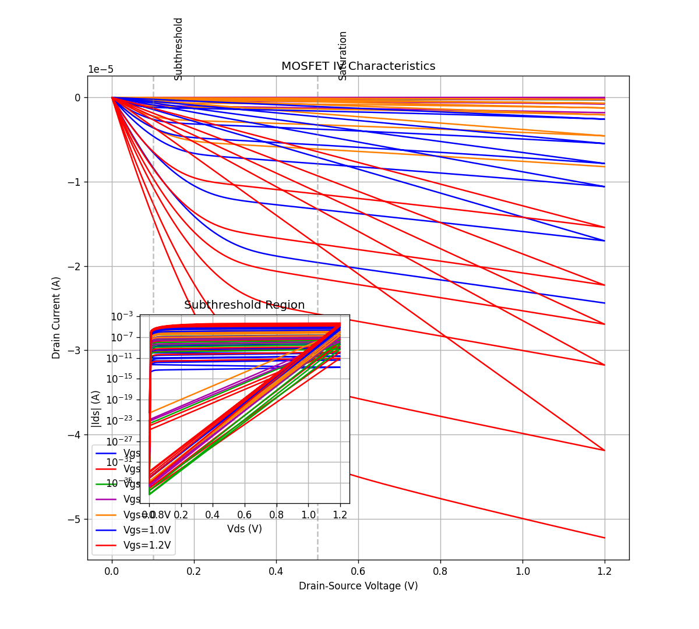

### Bias Point Analysis
- [✓] Voltage Biasing Points
  - Points: 9 VDS points, 9 VGS points
- [✓] Current Range
  - IDS: -2.73e-05A to 2.37e-27A
  - IG: 0.00e+00A to 0.00e+00A
  - IS: -2.37e-27A to 2.73e-05A
  - IB: -6.22e-36A to 1.12e-14A
- [✓] KCL Error Range
  - KCL Error: 0.00%

*KCL verification showing current balance*

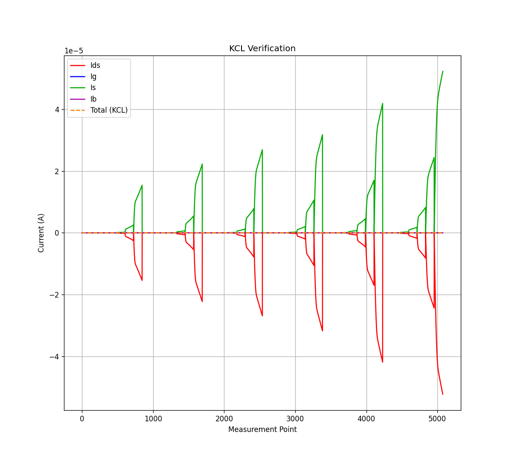

### Temperature Analysis
- [✓] Temperature sweep is performed
  - Points: [-40, 0, 25, 50, 100, 150]
- [✓] Temperature coefficient is calculated
  - Temperature Coefficient: -0.000000 /°C
- [✓] Device behavior is valid
  - Current Range: -5.226e-05A to 3.339e-22A
- [✓] Temperature-dependent behavior is valid

*Temperature analysis showing current variation*

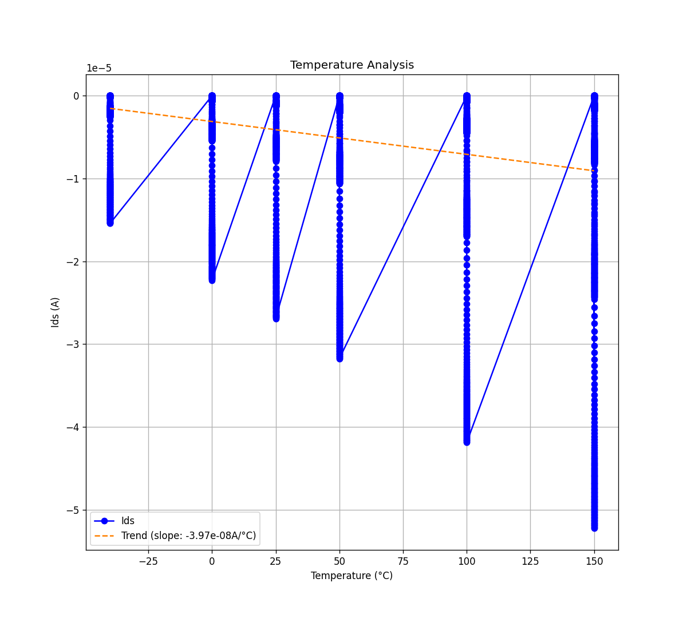

### Thermodynamic Analysis
- [✓] Energy is conserved
  - Power Range: 0.000e+00W to 6.271e-05W
- [✓] Device is efficient
  - Efficiency Range: 9.187e+00 to 1.671e+10
- [✓] Temperature coefficient is calculated
  - Value: 2.72e-02/°C

### Physical Properties Analysis
- ✗ Physical monotonicity over bias, geometry, and temperature: *In Progress*
- ✗ Parameter sweep simulations: *In Progress*
- ✗ Physical symmetries (currents, charges, their derivatives): *In Progress*
- ✗ Cross-derivative analysis: *In Progress*
- ✗ Terminal permutation checks: *In Progress*

## 4. Transient Analysis
### Large-Signal Transient
- [✓] Large Signal Transient Verified
  - Maximum Drain Current: 1.628584e-05A
  - Gate Voltage Rise Time: 400ps

*Large-signal transient analysis showing voltages and current response*

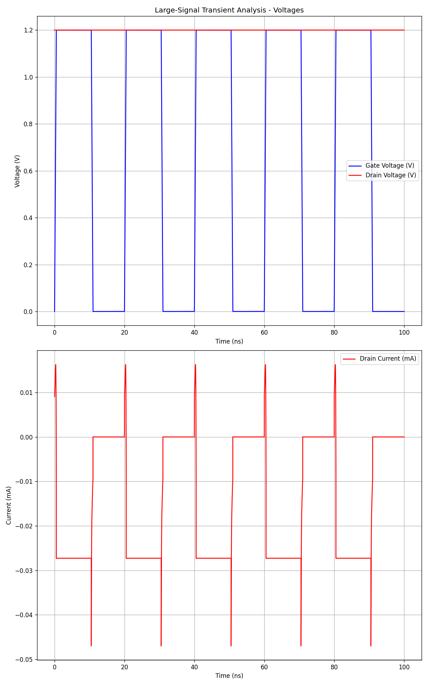

### Switching Simulations
- [✓] Propagation Delay Verified
  - Propagation Delay: 416.383ps
  - Transient sample interval: 2.7039ps

  - Maximum Switching Power: 7.728442e-05W

  - Average Switching Power: 6.451955e-06W

*Inverter switching analysis showing input/output voltages and power*

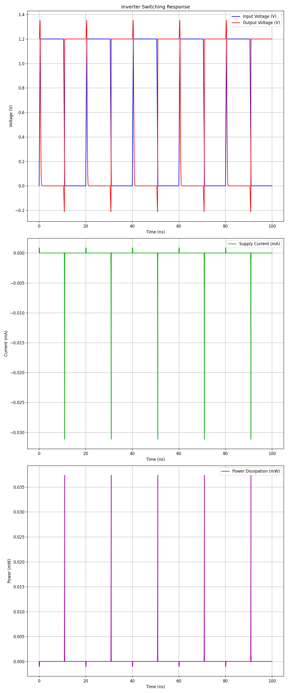

### Delay Effect Simulations
- [✓] Propagation delay through inverter chain analyzed
  - Stage 1 Delay: 1089.12ps

  - Stage 2 Delay: 1145.32ps

  - Stage 3 Delay: 569.313ps

  - Total Delay: 2648.26ps
  - Transient sample interval: 2.7039ps

*Delay effect analysis showing signal propagation through inverter chain*

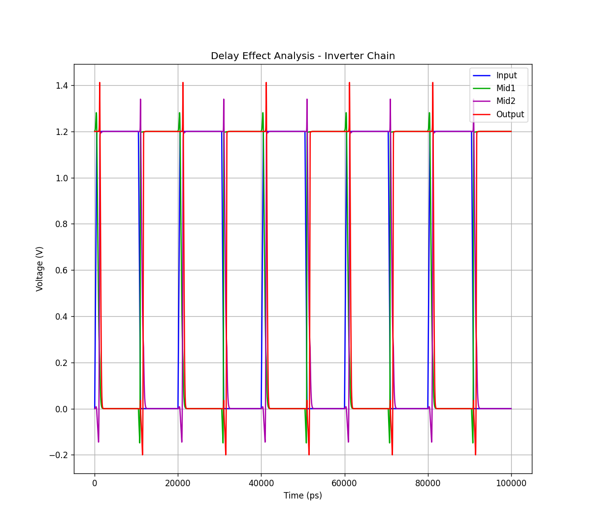

### Transient Simulations for Power Dissipation
- [✓] Temperature-dependent power analysis completed
  - Maximum Power at 27°C: 7.728442e-05W

  - Maximum Power at 100°C: 7.851916e-05W

  - Average Power at 27°C: 6.451955e-06W

  - Average Power at 100°C: 6.000507e-06W

  - Power Temperature Coefficient: 1.691438e-08W/°C

*Power dissipation analysis at different temperatures*

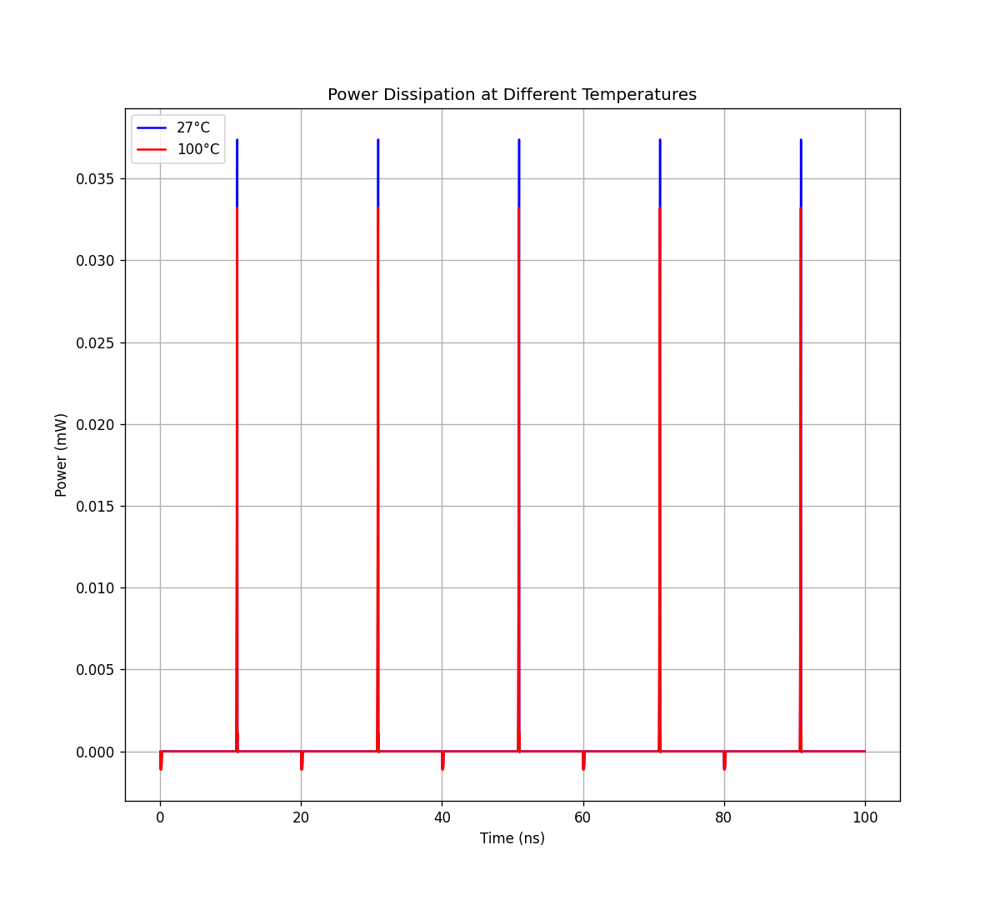

*Energy consumption analysis at different temperatures*

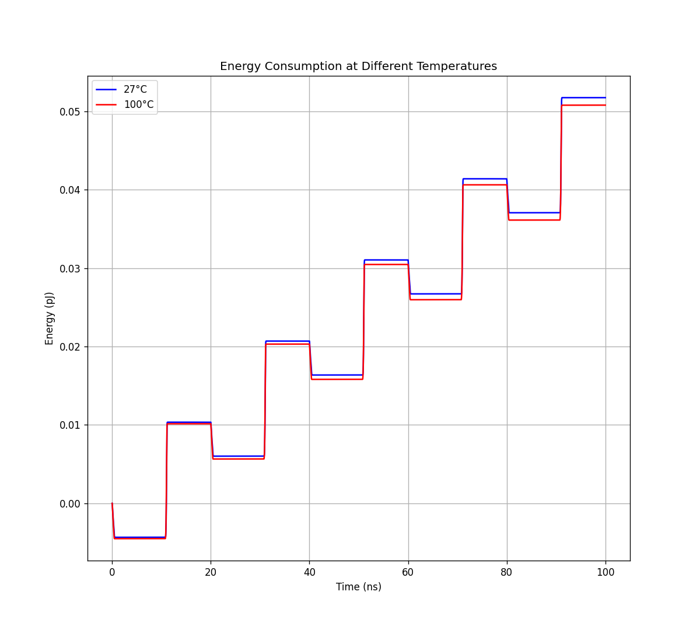

### Quasi-Static Analysis
- [✓] Charge conservation analyzed
*Quasi-static time-domain behavior analysis*

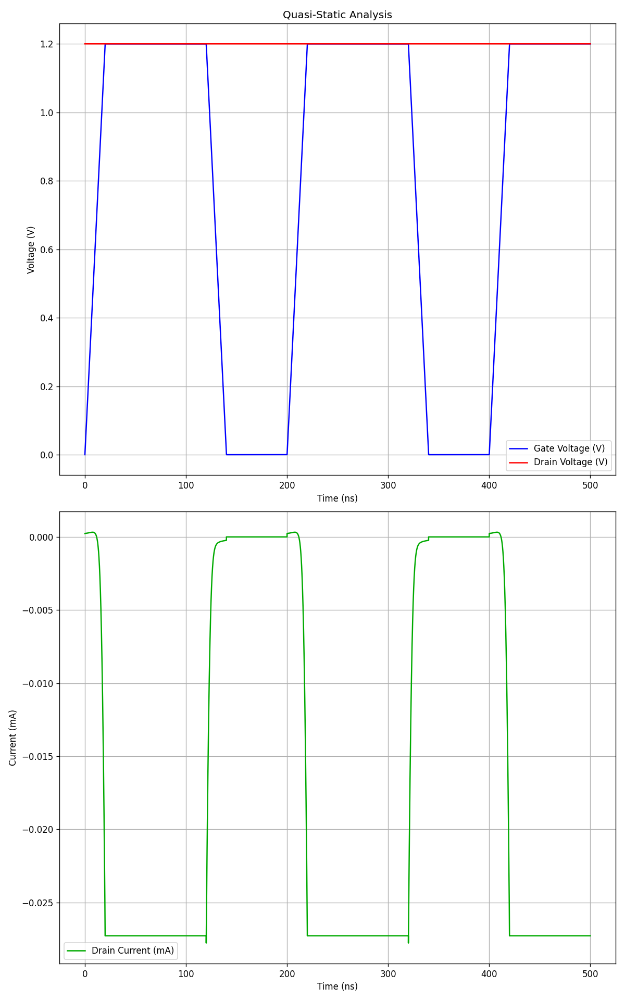

*Quasi-static I-V characteristic showing relationship between gate voltage and drain current*

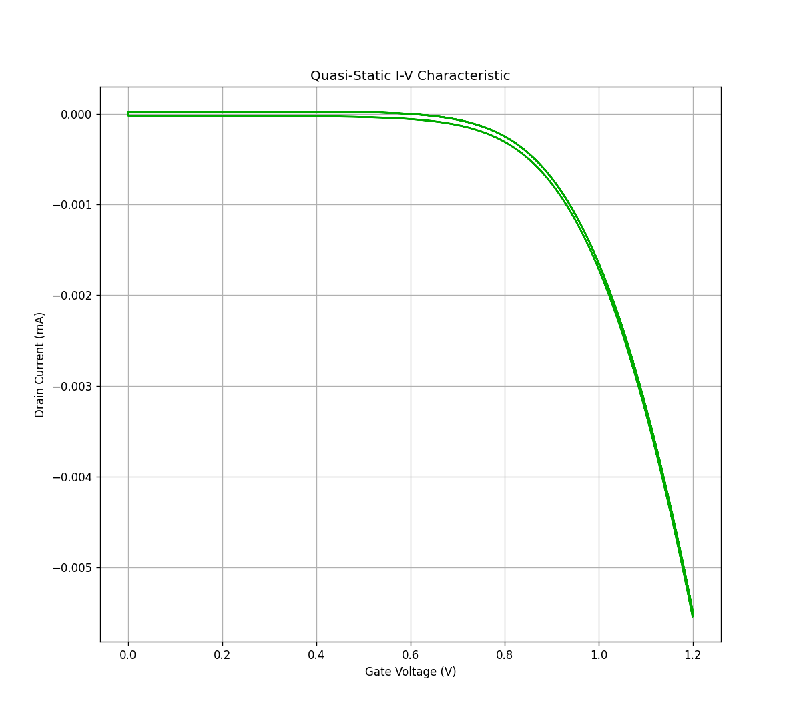

### Charge Conservation Checks
- [✓] Charge conservation analyzed

  - Maximum charge balance error: 0.000000e+00 C

  - Maximum current balance error: 0.000000e+00 A

*Terminal currents and charges analysis*

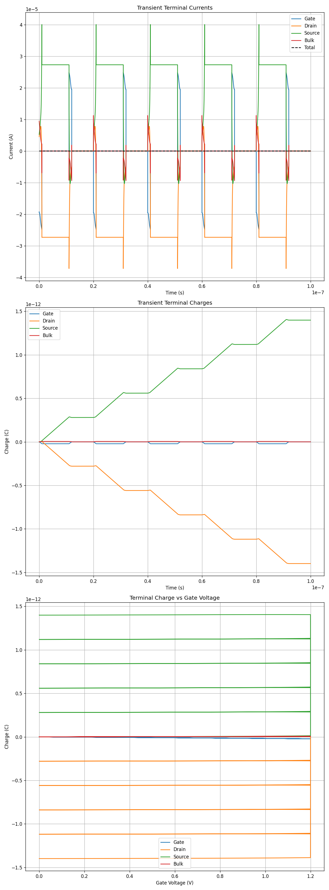

*Total charge conservation analysis*

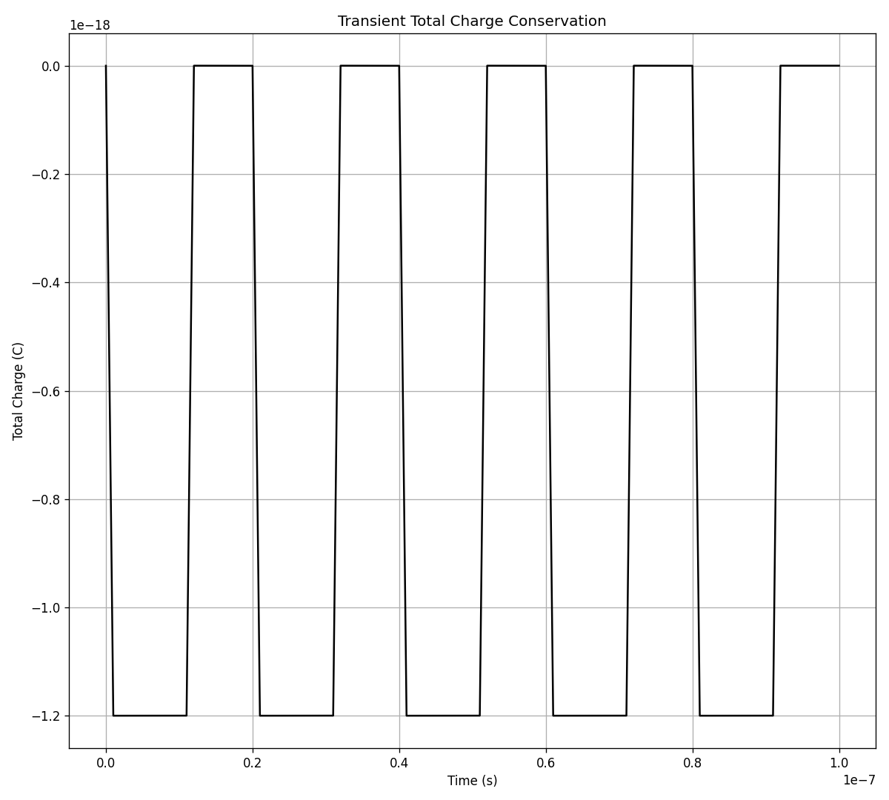

## 5. AC Analysis
### Small-Signal Analysis
- [✓] AC small-signal simulations verified
  - Gate capacitance range: 16.23fF to 22.67fF
  - Frequency range: 1.00e+06Hz to 1.00e+09Hz
  - Max capacitance at: 0.00V

*CV characteristics showing gate capacitance variation with gate voltage*

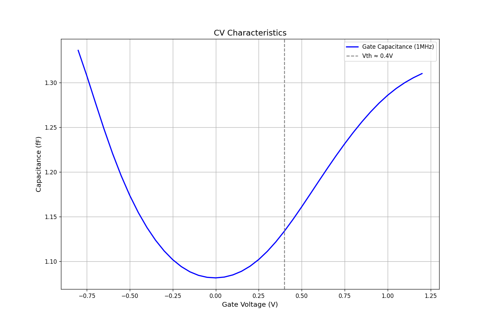

Capacitance components (Cgb, Cgs, Cgd) variation with gate voltage*

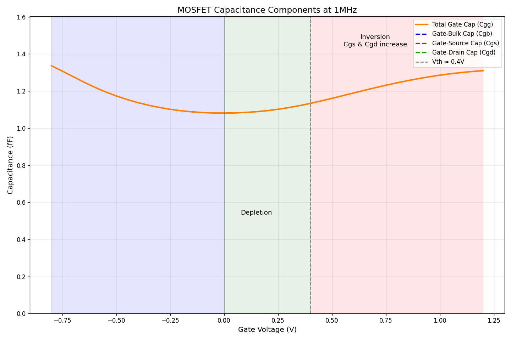

### AC-Integral Large-Signal Capacitance
- [✓] Large-signal capacitances computed from AC C(V) integral
  - Path: Vg -0.8 → 1.2 V (ΔV=2.0)
  - Cgg source: Cgg_1MHz from cv_data.txt
  - Cgg_ls: 18.373270 fF
  - Cgs_ls: -6.235008 fF
  - Cgd_ls: -5.157364 fF
  - Cgb_ls: -6.980895 fF
  - Output: data/ac_ls_caps_from_cv_integral.csv
  - Output: data/ac_qg_from_cv_integral.csv
  - Per-gate-area (W*L) normalization available
    - Geometry: W=10 µm, L=1 µm, Area=10 µm²
    - Cgg_ls/Area: 1.837327 fF/µm²
    - Cgs_ls/Area: -0.623501 fF/µm²
    - Cgd_ls/Area: -0.515736 fF/µm²
    - Cgb_ls/Area: -0.698090 fF/µm²
    - Output: data/ac_ls_caps_from_cv_integral_per_gate_area.csv
    - Output: data/ac_cv_caps_1MHz_per_gate_area.csv

### S-Parameter Analysis
- [✓] High-frequency AC simulations verified
  - Frequency range: 1MHz to 1GHz
- [✓] S-parameter analysis verified
  - S11 range: -0.000729645dB to 0dB
  - S21 range: -58.294dB to -46.453dB
  - S12 range: -114.03dB to -54.0309dB
  - S22 range: -0.000712272dB to -0.00061672dB
- [✓] RF simulations verified
  - Isolation: >-7.5779dB

*S-Parameter analysis showing frequency response characteristics*

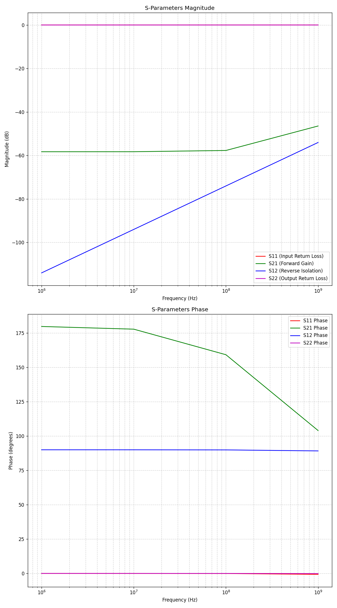

### Non-Quasi-Static Effects Analysis
- [✓] NQS effects verified
  - Maximum phase shift: 177.836
  - Frequency range: 10MHz to 10GHz

*Non-quasi-static effects analysis showing phase shift between gate voltage and drain current*

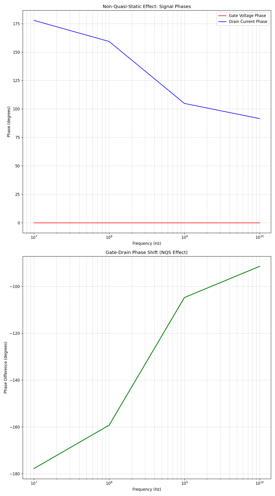

### Charge Conservation Analysis
- [✓] Charge conservation verified
  - Total charge error: 0.0
  - Max current: 0.0
  - Current Threshold: 1e-12

*Terminal currents and charges analysis*

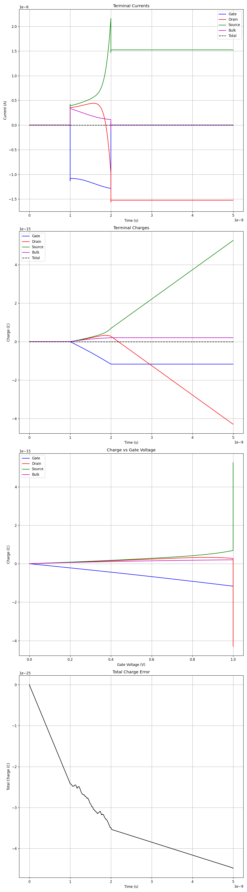

## 6. Noise Analysis
### Thermal Noise Analysis
- [✓] Thermal noise analysis completed
  - Max Noise: 1.38e-10 V²/Hz
  - Min Noise: 1.82e-11 V²/Hz
  - Avg Noise: 5.86e-11 V²/Hz
  - Noise Floor: 6.22e-11 V²/Hz
  - Frequency Range: 1Hz to 1000MHz

*Thermal noise power spectral density analysis comparing different bias conditions, showing how the device noise characteristics change with bias voltage.*

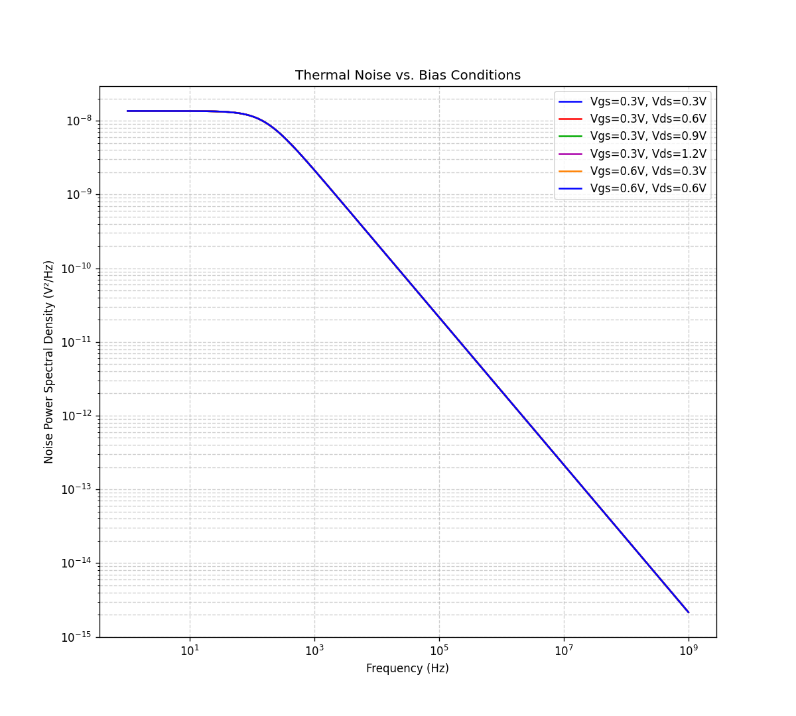

### Flicker Noise Analysis
- [✓] Flicker noise analysis completed
  - Coefficient (K): 1.38e-10
  - Exponent (γ): 4.75e-16 (ideally -1.0 for pure 1/f noise)
  - Correlation (R²): 0.6067
  - Corner Frequency: *Not measured*

*Flicker (1/f) noise analysis showing the power spectral density decreasing with frequency, a characteristic behavior in semiconductor devices associated with trapping/detrapping processes.*

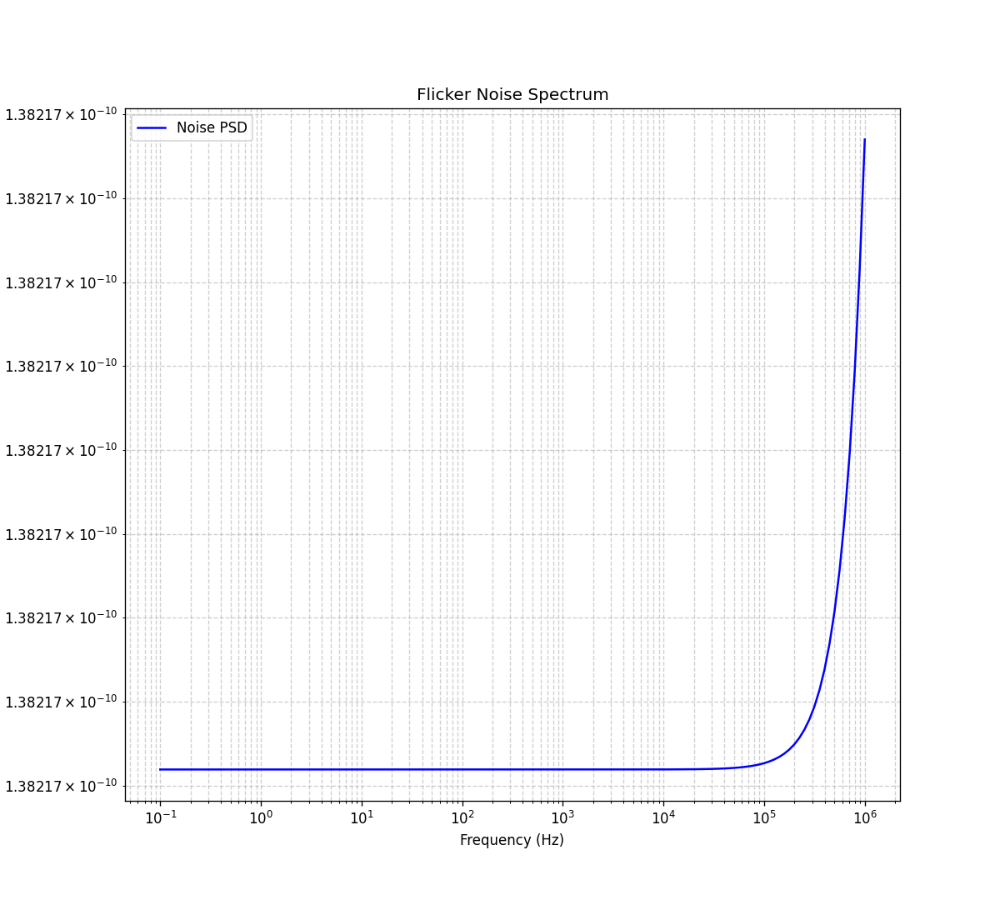

### Short Noise Analysis
- [✓] Short noise analysis completed
  - Shot Noise Level: 7.43e-10 V²/Hz
  - Standard Deviation: 1.52e-14 V²/Hz
  - Variation Coefficient: 0.0000

*Shot noise analysis showing the frequency-independent noise component that arises from the discrete nature of electric charge carriers crossing potential barriers.*

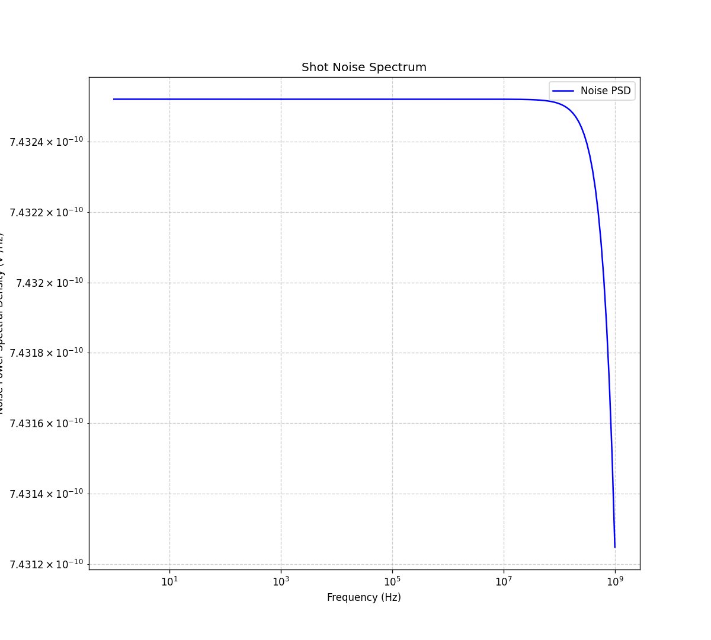

### Temperature Dependence
- [✓] Short noise analysis completed
  - Temperature Coefficient: 2.63e-12 V²/Hz/°C
  - Temperature-Noise Correlation: 0.9786995481332915
  - Temperature Range: -40.0°C to 150.0°C

*Noise variation with temperature, illustrating how thermal effects influence the device's noise characteristics across the operational temperature range.*

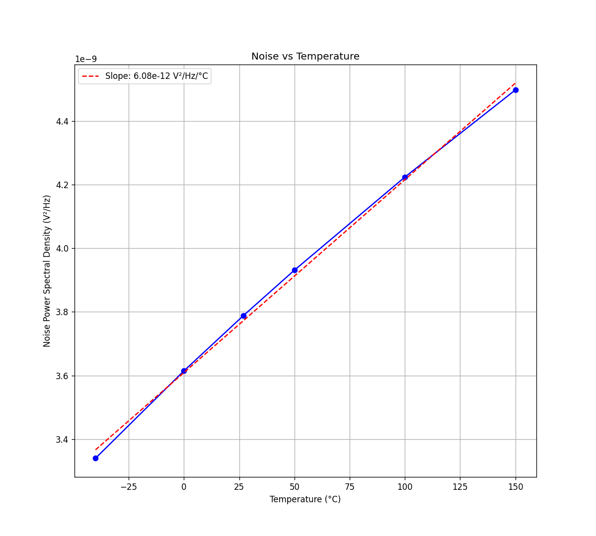

### Bias Dependence
- [✓] Bias Dependance analysis completed
*Thermal Noise Results at Different Bias Points*

| Bias Condition | Max Noise (V²/Hz) | Min Noise (V²/Hz) | Avg Noise (V²/Hz) | Noise Floor (V²/Hz) |
|----------------|-------------------|-------------------|-------------------|--------------------|
| Vgs=0.3V, Vds=0.3V | 1.84e-11 | 1.82e-11 | 1.82e-11 | 1.82e-11 |
| Vgs=0.3V, Vds=0.6V | 2.08e-11 | 2.06e-11 | 2.06e-11 | 2.06e-11 |
| Vgs=0.3V, Vds=0.9V | 2.35e-11 | 2.33e-11 | 2.33e-11 | 2.33e-11 |
| Vgs=0.3V, Vds=1.2V | 2.65e-11 | 2.63e-11 | 2.63e-11 | 2.63e-11 |
| Vgs=0.6V, Vds=0.3V | 1.25e-10 | 1.25e-10 | 1.25e-10 | 1.25e-10 |
| Vgs=0.6V, Vds=0.6V | 1.38e-10 | 1.38e-10 | 1.38e-10 | 1.38e-10 |

<!-- collection-run-integrity -->
## Run Integrity

- Model: `sky130__fd__bs__flash__special__sonosfet__original__model__expansion_translation`
- Model MD5: `35c51eb2c9233d013d733a2942a7daa4`
- Simulator: `ngspice`
- Modes: `dc, transient, ac, noise`
- Started: `2026-07-29T11:53:57.005655+00:00`
- Finished: `2026-07-29T12:02:43.865153+00:00`
- Elapsed seconds: `526.859498`
- Peak resident memory KiB: `276972`
- Process return code: `0`
- Benchmark circuit: fixed, source-controlled simulator-native fixture; no circuit AST or netlist translation was used.
- Benchmark contract SHA-256: `3536913684d2a50618f6b9aaee49c88acffe99dbd318a0dd2dc19a5b01d391dc`
- Device-model handoff preserved model names, polarity, and every AST parameter; no fallback or parameter lowering was applied.
- Executed netlists: `netlist/dc`, `netlist/transient`, `netlist/ac`, and `netlist/noise` (simulator-native extensions).
- Plot inventory: `26` non-empty PNG files generated from simulator data.
